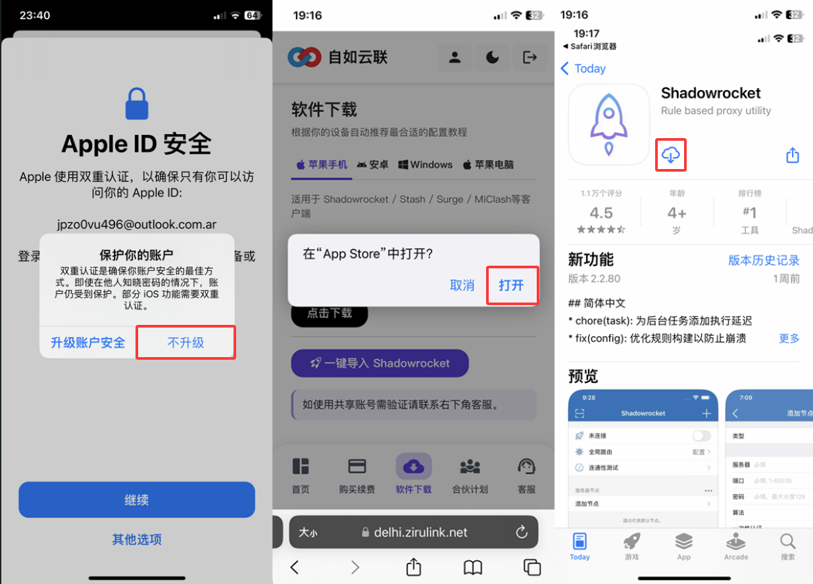
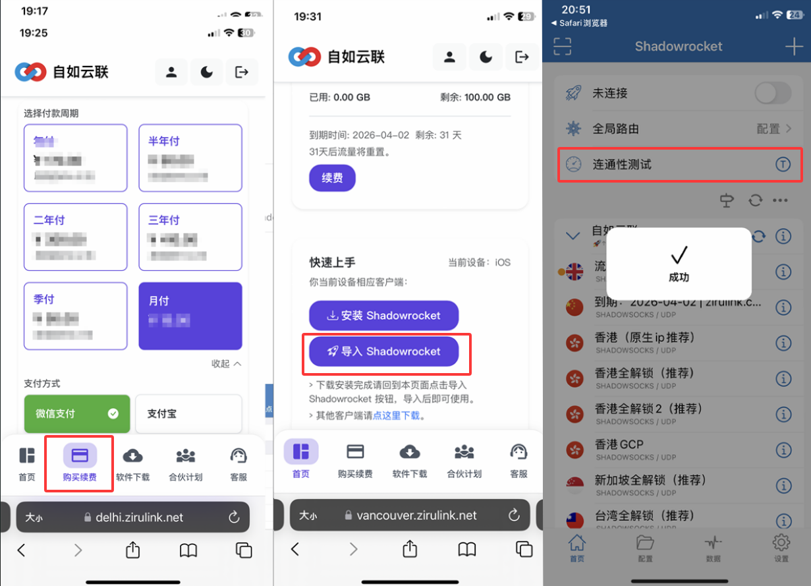

# ZiruLink-Accelerator-Technical-Resources

自如加速器官方技术仓库。提供基于 xudp 2.0 协议的链路调优方案、Shadowrocket 安装教程及环境风控对抗实战指南，助您实现跨境通讯顺滑自如。

---

## Shadowrocket (小火箭) 快速下载与安装指南

为了确保您的 iOS 设备能够实现 **连接自如**，请按照以下四个步骤进行操作。

<h3 style="background: #f4f4f4; padding: 5px 10px; border-left: 4px solid #4A90E2;">1. 账号注册与登录官网</h3>
<ul>
    <li>使用邮箱在官网 <a href="https://ziru.us" target="_blank">ziru.us</a> 注册并登录账号。</li>
    <li>点击菜单栏的<strong>【软件下载】</strong>，复制提供的<strong>免费美区 Apple ID</strong>。</li>
    <li>打开手机 <strong>App Store</strong>，点击右上角头像进入账户页面。</li>
</ul>

    

<h3 style="background: #f4f4f4; padding: 5px 10px; border-left: 4px solid #4A90E2;">2. 登录免费美区 Apple ID</h3>
<ul>
    <li>在账户页面拉到最底部，点击<strong>【退出登录】</strong>。</li>
    <li>将获取的<strong>免费美区 Apple ID</strong> 粘贴进去并输入密码登录。</li>
    <li>弹出认证后点击<strong>【其他选项】</strong>并选择<strong>【不升级】</strong>。</li>
</ul>

    

<h3 style="background: #f4f4f4; padding: 5px 10px; border-left: 4px solid #4A90E2;">3. 安装 Shadowrocket 软件</h3>
<ul>
    <li>返回官网【软件下载】界面，点击<strong>【下载】</strong>。</li>
    <li>在 App Store 中点击安装 Shadowrocket。</li>
</ul>

    

<h3 style="background: #f4f4f4; padding: 5px 10px; border-left: 4px solid #4A90E2;">4. 购买订阅并一键导入</h3>
<ul>
    <li>官网点击<strong>【购买续费】</strong>，选择套餐并完成购买。</li>
    <li>返回首页点击<strong>【导入 Shadowrocket】</strong>。</li>
    <li>导入成功后点击<strong>【连通性测试】</strong>，开启开关即可连接外网。</li>
</ul>

    

---

### 🛠️ 技术支持与资源引导
* **官方直连地址：** [ziru.us](https://ziru.us)
* **性能监测白皮书：** [xudp 2.0 调优实战](https://www.babeedu.net/?p=760)
* **官方交流TG ：@ziru921
